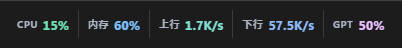
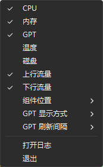

# Window Taskbar Widget

### 运行效果


#### 菜单



[中文](#中文说明) | [English](#english)

### 中文说明

### 项目简介

Window Taskbar Widget 是一个使用 Tauri、Rust、Vue 3 和 TypeScript 开发的 Windows 11 任务栏状态工具。它将透明、无边框的 WebView 窗口挂载到 Windows 主任务栏，用紧凑的方式持续显示系统资源与 GPT/Codex 用量。

这个项目最初的想法并不只是制作一个固定的资源监控器，而是希望逐步构建一个类似 GNOME 顶部状态栏的平台：核心程序负责窗口挂载、布局、配置、生命周期与插件通信，不同功能由可独立接入的插件提供。当前版本先从一个可实际使用的小工具开始，验证 Windows 任务栏嵌入、系统指标采集、托盘配置和外部服务用量接入等基础能力。

### 当前功能

- 显示 CPU 和内存使用率。
- 显示温度；无法获取温度传感器数据时显示 `N/A`。
- 显示磁盘容量占用率。
- 显示网络上行与下行速率。
- 读取 Codex CLI 登录信息并显示 GPT/Codex 用量。
- GPT 支持显示“余量”或“用量”。
- GPT 刷新间隔支持 30 秒、1 分钟、3 分钟、5 分钟和 10 分钟，默认 1 分钟。
- 支持将组件放在任务栏左侧，或放在系统通知区域左侧。
- 靠右显示时避让隐藏图标、网络、音量、电池和时钟等系统区域。
- 通过系统托盘右键菜单控制显示项目、组件位置和 GPT 设置。
- 配置保存为 JSON，GPT/Codex 请求相关错误写入日志文件。
- 支持从托盘菜单使用 Windows 记事本打开日志。

### 开发模式运行

请先安装 Node.js、npm、Rust stable 工具链和 Windows WebView2，然后在项目目录运行：

```bat
cd /d D:\Projects\2026\WindowTaskbarWidget\tbwidget
npm run tauri -- dev
```

首次运行可能需要下载 Rust、Tauri 和前端依赖，具体时间取决于网络环境。

### GPT/Codex 认证

程序从 Codex CLI 的 `auth.json` 中读取 `tokens.access_token`。认证文件路径按以下优先级确定：

1. 如果设置了 `CODEX_HOME`，读取 `%CODEX_HOME%\auth.json`。
2. 否则读取 `%USERPROFILE%\.codex\auth.json`。

如果认证文件不存在、内容无效或登录令牌已经过期，请先运行：

```bat
codex login
```

Access token 只在 Rust 后端读取和使用，不会返回到 Vue，也不会写入日志。

### 配置文件

开发模式下，配置文件位于 `tbwidget` 工程根目录：

```text
widget-config.json
```

打包后，配置文件位于程序 exe 所在目录。程序启动时会读取该文件；文件不存在时会自动创建默认配置。

配置示例：

```json
{
  "position": "left",
  "cpu_visible": true,
  "memory_visible": true,
  "gpt_visible": true,
  "temperature_visible": true,
  "disk_visible": true,
  "upload_visible": true,
  "download_visible": true,
  "gpt_refresh_seconds": 60,
  "gpt_display_mode": "remaining",
  "gpt_proxy_url": ""
}
```

其中：

- `position` 支持 `left` 或 `right`。
- `gpt_display_mode` 支持 `remaining`（余量）或 `used`（用量）。
- `gpt_refresh_seconds` 支持 `30`、`60`、`180`、`300` 或 `600`。
- `gpt_proxy_url` 为空时直连，也可填写 HTTP、HTTPS 或 SOCKS5 代理地址。

### GPT 代理设置

中国大陆网络环境通常无法直接访问 GPT/Codex 用量接口，需要在 `widget-config.json` 中设置可用代理，例如：

```json
"gpt_proxy_url": "http://127.0.0.1:7890"
```

或：

```json
"gpt_proxy_url": "socks5://127.0.0.1:7890"
```

修改代理配置后请重启程序。代理仅用于 GPT/Codex 用量请求，不影响系统资源指标采集。如果代理地址包含账号和密码，请妥善保护配置文件，避免泄露凭据。

### 日志

日志文件与配置文件位于同一目录：

```text
widget.log
```

每次启动程序都会清空并重新创建日志，因此日志只保留当前运行期间的错误。

可以通过托盘菜单中的“打开日志”使用 Windows 记事本查看。日志会记录 GPT 认证文件读取、代理配置、HTTP 请求、状态码和响应解析等错误，但不会记录 access token 或接口响应正文。

### 开机启动

如果需要开机自动运行，可以为打包后的 exe 创建快捷方式，并将快捷方式放入当前用户的启动文件夹：

```text
%APPDATA%\Microsoft\Windows\Start Menu\Programs\Startup
```

可以按 `Win + R`，输入下面的命令快速打开该目录：

```text
shell:startup
```

然后把程序快捷方式复制进去。建议使用快捷方式，而不是直接复制 exe，这样程序旁边的 `widget-config.json` 和 `widget.log` 仍会保存在原程序目录。

### 注意事项

- 当前版本仅面向 Windows 11，并依赖 Windows 主任务栏内部窗口结构。
- 靠右定位依赖 `TrayNotifyWnd`。如果 Windows 更新改变了任务栏内部结构，程序会安全回退到靠左位置，避免覆盖系统通知区域。
- 高 DPI、多个显示器、任务栏位置变化和 Explorer 重启等场景仍需持续完善。
- 当前只挂载到主任务栏，不处理副显示器任务栏。
- WebView 默认关闭鼠标交互，鼠标会穿透到下方任务栏，因此组件内的项目不能直接点击；设置请使用系统托盘菜单。
- 磁盘数据显示的是容量占用率，不是任务管理器中的实时磁盘活动率。
- 网络速率会聚合系统识别到的网卡，可能包含 VPN、WSL、Hyper-V 等虚拟网卡。
- 温度依赖系统可以提供的传感器信息，无法获取时显示 `N/A`。
- 国内网络环境访问 GPT/Codex 通常需要代理，代理是否可用由用户自行确认。
- 配置和日志位于 exe 同目录时，该目录必须具有写入权限；不建议把程序直接放在需要管理员权限才能写入的目录。
- 每次启动都会清空上一轮日志。如需保留错误记录，请在重启前复制 `widget.log`。

### 后续方向

未来希望把当前工具演进为一个可扩展的 Windows 状态栏平台。可能的方向包括：

- 定义统一的插件接口和生命周期。
- 允许插件声明自己的指标、图标、刷新频率和托盘配置。
- 支持动态加载或独立进程插件，降低单个插件故障对核心程序的影响。
- 提供统一布局、排序、主题、权限和配置管理。
- 支持更多系统信息、开发工具状态、网络服务状态和第三方用量插件。
- 改善多显示器、Explorer 重启恢复和不同 DPI 环境下的稳定性。

当前版本是这个方向的第一步：先把一个小而完整的任务栏工具做好，再逐步抽象出可复用的平台能力。

---

## English

### Overview

Window Taskbar Widget is a Windows 11 taskbar status utility built with Tauri, Rust, Vue 3, and TypeScript. It embeds a transparent, borderless WebView into the primary Windows taskbar and continuously displays system metrics and GPT/Codex usage in a compact layout.

The original goal is broader than a fixed resource monitor. The long-term idea is to build a GNOME-like top status bar platform for Windows: the core application would manage taskbar embedding, layout, configuration, lifecycle, and plugin communication, while independently developed plugins would provide individual features. The current release starts with a small, practical utility to validate the foundations, including Windows taskbar integration, system metric collection, tray configuration, and external usage services.

### Current Features

- CPU and memory utilization.
- Temperature display, with `N/A` when no valid sensor is available.
- Disk capacity utilization.
- Network upload and download rates.
- GPT/Codex usage based on Codex CLI authentication.
- GPT display modes for remaining quota or used quota.
- GPT refresh intervals of 30 seconds, 1 minute, 3 minutes, 5 minutes, or 10 minutes; the default is 1 minute.
- Left placement or right placement immediately before the Windows notification area.
- Right placement avoids hidden icons, network, volume, battery, and clock areas.
- Tray-menu controls for visible metrics, widget position, and GPT settings.
- Persistent JSON configuration and file-based logging for GPT/Codex request errors.
- The log can be opened with Windows Notepad from the tray menu.

### Development Startup

Install Node.js, npm, the stable Rust toolchain, and Windows WebView2, then run:

```bat
cd /d D:\Projects\2026\WindowTaskbarWidget\tbwidget
npm run tauri -- dev
```

The first run may download Rust, Tauri, and frontend dependencies. The required time depends on network conditions.

### GPT/Codex Authentication

The application reads `tokens.access_token` from the Codex CLI `auth.json` file. The path is resolved in this order:

1. If `CODEX_HOME` is set, use `%CODEX_HOME%\auth.json`.
2. Otherwise, use `%USERPROFILE%\.codex\auth.json`.

If the file is missing, invalid, or contains an expired token, run:

```bat
codex login
```

The access token is read and used only by the Rust backend. It is never returned to Vue and is never written to the log.

### Configuration

In development mode, the configuration file is stored in the `tbwidget` project root:

```text
widget-config.json
```

In packaged builds, it is stored next to the executable. The application loads it at startup and creates a default configuration when it is missing.

Example:

```json
{
  "position": "left",
  "cpu_visible": true,
  "memory_visible": true,
  "gpt_visible": true,
  "temperature_visible": true,
  "disk_visible": true,
  "upload_visible": true,
  "download_visible": true,
  "gpt_refresh_seconds": 60,
  "gpt_display_mode": "remaining",
  "gpt_proxy_url": ""
}
```

Available values:

- `position`: `left` or `right`.
- `gpt_display_mode`: `remaining` or `used`.
- `gpt_refresh_seconds`: `30`, `60`, `180`, `300`, or `600`.
- `gpt_proxy_url`: empty for direct access, or an HTTP, HTTPS, or SOCKS5 proxy URL.

### GPT Proxy

Direct access to the GPT/Codex usage endpoint may be unavailable in some regions, including typical mainland China network environments. Configure a working proxy in `widget-config.json` when required:

```json
"gpt_proxy_url": "http://127.0.0.1:7890"
```

or:

```json
"gpt_proxy_url": "socks5://127.0.0.1:7890"
```

Restart the application after changing the proxy. The proxy is used only for GPT/Codex usage requests and does not affect local system metric collection. Protect the configuration file if the proxy URL contains credentials.

### Logging

The log is stored next to the configuration file:

```text
widget.log
```

The log is cleared and recreated every time the application starts, so it contains errors from the current run only.

Use “Open Log” in the tray menu to open it with Windows Notepad. The log covers authentication-file access, proxy configuration, HTTP requests, status codes, and response parsing. It does not contain the access token or API response body.

### Start with Windows

To start the application automatically after signing in, create a shortcut to the packaged executable and place the shortcut in the current user's Startup folder:

```text
%APPDATA%\Microsoft\Windows\Start Menu\Programs\Startup
```

Press `Win + R` and run the following command to open the folder quickly:

```text
shell:startup
```

Copy the shortcut into that folder. Using a shortcut instead of copying the executable keeps `widget-config.json` and `widget.log` next to the original executable.

### Notes and Limitations

- The current version targets Windows 11 and depends on the internal structure of the primary Windows taskbar.
- Right placement depends on `TrayNotifyWnd`. If a Windows update changes this structure, the widget safely falls back to the left to avoid covering notification icons.
- High-DPI environments, multiple monitors, taskbar layout changes, and Explorer restarts require further improvement and testing.
- Only the primary taskbar is currently supported.
- The WebView ignores mouse input by default, so events pass through to the taskbar below. Use the tray menu for configuration.
- Disk usage represents capacity utilization, not real-time disk activity from Task Manager.
- Network rates aggregate interfaces detected by the system and may include VPN, WSL, Hyper-V, and other virtual adapters.
- Temperature availability depends on accessible system sensors. `N/A` is shown when no valid reading is available.
- GPT/Codex access may require a proxy depending on the region and network environment. Users are responsible for providing and validating their own proxy.
- The executable directory must be writable because the configuration and log are stored next to the executable. Avoid protected directories that require administrator privileges for writes.
- The previous log is erased on every startup. Copy `widget.log` before restarting if it must be preserved.

### Long-Term Direction

The intended direction is to evolve this utility into an extensible Windows status bar platform. Possible future work includes:

- A unified plugin API and lifecycle.
- Plugin-defined metrics, icons, refresh intervals, and tray settings.
- Dynamic or out-of-process plugins to isolate failures from the core application.
- Shared layout, ordering, theme, permission, and configuration management.
- Additional plugins for system information, developer tools, network services, and third-party quotas.
- Better multi-monitor support, Explorer restart recovery, and high-DPI stability.

This version is the first step: build a small but complete taskbar utility first, then gradually extract reusable platform capabilities.
